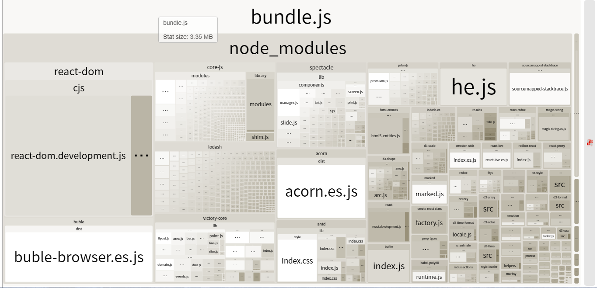

# Curriculum Vitae

## Getting Started

After downloading the boilerplate, your first order of business is to open a terminal and run
```bash
npm install
```
if you're about that life.

to remove the existing version control.

Then, to start up the local server, run
```bash
npm start
```

Open a browser and hit [http://localhost:3000](http://localhost:3000), and we are ready to roll.

## Build & Deployment

Building the dist version of the project is as easy as running
```bash
npm run build
```
## Problem
1. The bundle.js is very large, and it contains lots of libraries

